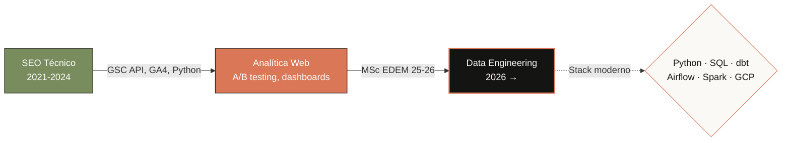

<!-- ╔══════════════════════════════════════════════════════════════╗
     HERO
══════════════════════════════════════════════════════════════ -->

  

  
  
  
  

  

<!-- ╔══════════════════════════════════════════════════════════════╗
     SOBRE MÍ
══════════════════════════════════════════════════════════════ -->
## Sobre mí

Vengo de **3+ años en SEO técnico y analítica web** y estoy haciendo la transición full a **Data Engineering**. Mientras curso el **MSc Data Analytics en EDEM** (Valencia, 25-26), construyo proyectos *end-to-end* en público para enseñar mi forma de pensar, no solo mi stack.

**Lo que me diferencia:** ya he trabajado con datos en producción (Search Console API, automatización de informes, experimentos sobre tráfico orgánico). Ahora aprendo a llevarlos a escala con stack moderno.

> **Busco:** primer rol como **Data Engineer / Analytics Engineer / Data Analyst** en Valencia o remoto.

<!-- ╔══════════════════════════════════════════════════════════════╗
     CURRENT FOCUS
══════════════════════════════════════════════════════════════ -->
## Ahora mismo

- Construyendo un pipeline streaming Kafka → PySpark → Postgres dockerizado
- Preparando certificaciones **Google Cloud** (Associate Cloud Engineer → Professional Data Engineer)
- Cursando MSc Data Analytics en EDEM (Valencia, 25-26)
- Explorando ciberseguridad data-driven (S2 Grupo ENIGMA 13.0)
- Pregúntame sobre modelado dbt, dashboards Looker Studio o cómo pasarte del SEO al data

<!-- ╔══════════════════════════════════════════════════════════════╗
     STACK
══════════════════════════════════════════════════════════════ -->
## Stack técnico

<table>
  <tr>
    <td valign="top" width="33%">
      <h4>Lenguajes & Procesamiento</h4>
      

         
         
         
         
        
      

    </td>
    <td valign="top" width="33%">
      <h4>Data Stack</h4>
      

         
         
         
         
        
      

    </td>
    <td valign="top" width="33%">
      <h4>Infra & Viz</h4>
      

         
         
         
         
         
        
      

    </td>
  </tr>
</table>

<!-- ╔══════════════════════════════════════════════════════════════╗
     PROYECTOS
══════════════════════════════════════════════════════════════ -->
## Proyectos destacados

| Proyecto | Stack | Qué demuestra |
|---|---|---|
| **[seo-analytics-pipeline](https://github.com/FranciscoAlvarezVaras/seo-analytics-pipeline)** | Python · GSC API · dbt · BigQuery · Looker Studio | Pipeline end-to-end: extracción, modelado en capas staging/marts, dashboard publicado |
| **[realtime-streaming-pipeline](https://github.com/FranciscoAlvarezVaras/realtime-streaming-pipeline)** | Kafka · PySpark · Postgres · Docker | Ingesta en tiempo real de un stream público, procesado con Structured Streaming, todo dockerizado |
| **[orchestrated-etl-airflow](https://github.com/FranciscoAlvarezVaras/orchestrated-etl-airflow)** | Airflow · dbt · BigQuery · Docker Compose | DAG diario que orquesta ingesta + modelado dbt + notificación Slack. Stack típico Analytics Engineering |

> Cada proyecto incluye diagrama de arquitectura, instrucciones de despliegue y decisiones técnicas documentadas.

<!-- ╔══════════════════════════════════════════════════════════════╗
     ACHIEVEMENTS — TROPHIES
══════════════════════════════════════════════════════════════ -->
## Achievements unlocked

  

<!-- ╔══════════════════════════════════════════════════════════════╗
     FORMACIÓN
══════════════════════════════════════════════════════════════ -->
## Formación

| Programa | Centro | Año |
|---|---|---|
| **MSc Data Analytics** | EDEM Escuela de Empresarios · Valencia | 2025-2026 *(en curso)* |
| **MSc Neuromarketing** | UNIR | 2020-2021 |
| **BSc Business** | Universidad Nueva Esparta | 2015-2019 |

<!-- ╔══════════════════════════════════════════════════════════════╗
     CERTIFICACIONES GCP
══════════════════════════════════════════════════════════════ -->
## Certificaciones — Google Cloud

Mi siguiente foco profesional. Las certificaciones GCP son el camino directo hacia un rol Data Engineer en Europa.

| Certificación | Estado |
|---|---|
| **Associate Cloud Engineer** | En estudio |
| **Associate Data Practitioner** | Siguiente |
| **Professional Data Engineer** | Meta a 12-18 meses |

**Topics que estoy tocando:** `BigQuery partitioning & clustering` · `dbt incremental models` · `data contracts` · `streaming pipelines` · `observabilidad (Great Expectations, Soda)`

<!-- ╔══════════════════════════════════════════════════════════════╗
     CONTACTO
══════════════════════════════════════════════════════════════ -->
## ¿Hablamos?

Si tienes una oportunidad **Data Engineer / Analytics Engineer / Data Analyst Junior** en Valencia o remoto, escríbeme:

<table>
  <tr>
    <td><strong>Email</strong></td>
    <td><a href="mailto:francisco92varas@gmail.com">francisco92varas@gmail.com</a></td>
  </tr>
  <tr>
    <td><strong>LinkedIn</strong></td>
    <td><a href="https://www.linkedin.com/in/frankalvarezv/">linkedin.com/in/frankalvarezv</a></td>
  </tr>
  <tr>
    <td><strong>Teléfono</strong></td>
    <td>+34 633 912 726</td>
  </tr>
</table>

<!-- ╔══════════════════════════════════════════════════════════════╗
     SNAKE — auto-generado por GitHub Action
══════════════════════════════════════════════════════════════ -->

  <picture>
    <source media="(prefers-color-scheme: dark)" srcset="https://raw.githubusercontent.com/FranciscoAlvarezVaras/FranciscoAlvarezVaras/output/github-snake-dark.svg" />
    <source media="(prefers-color-scheme: light)" srcset="https://raw.githubusercontent.com/FranciscoAlvarezVaras/FranciscoAlvarezVaras/output/github-snake.svg" />
    
  </picture>

  

