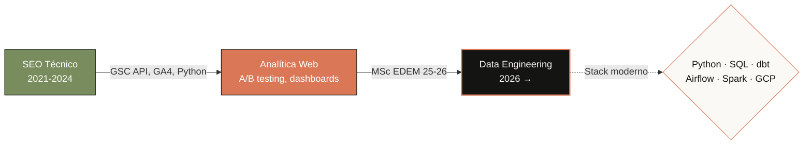

<!-- ╔══════════════════════════════════════════════════════════════╗
     HERO
══════════════════════════════════════════════════════════════ -->

  

  
  
  
  

  

<!-- ╔══════════════════════════════════════════════════════════════╗
     SOBRE MÍ
══════════════════════════════════════════════════════════════ -->
## 🧭 Sobre mí

Vengo de **3+ años en SEO técnico y analítica web** y estoy haciendo la transición full a **Data Engineering**. Mientras curso el **MSc Data Analytics en EDEM** (Valencia, 25-26), construyo proyectos *end-to-end* en público para enseñar mi forma de pensar, no solo mi stack.

**Lo que me diferencia:** ya he trabajado con datos en producción (Search Console API, automatización de informes, experimentos sobre tráfico orgánico). Ahora aprendo a llevarlos a escala con stack moderno.

> 🎯 **Busco:** primer rol como **Data Engineer / Analytics Engineer / Data Analyst** en Valencia o remoto.

<!-- ╔══════════════════════════════════════════════════════════════╗
     CURRENT FOCUS
══════════════════════════════════════════════════════════════ -->
## 🛠️ Ahora mismo

- 🔭 **Construyendo** un pipeline streaming Kafka → PySpark → Postgres dockerizado
- 🌱 **Aprendiendo** Snowflake (SnowPro Core → Advanced Data Engineer)
- 📚 **Cursando** MSc Data Analytics en EDEM (Valencia, 25-26)
- 🛡️ **Explorando** ciberseguridad data-driven (S2 Grupo ENIGMA 13.0)
- 💬 **Pregúntame sobre** modelado dbt, dashboards Looker Studio o cómo pasarte del SEO al data

<!-- ╔══════════════════════════════════════════════════════════════╗
     STACK
══════════════════════════════════════════════════════════════ -->
## 🧰 Stack técnico

<table>
  <tr>
    <td valign="top" width="33%">
      <h4>🐍 Lenguajes & Procesamiento</h4>
      

         
         
         
         
        
      

    </td>
    <td valign="top" width="33%">
      <h4>📊 Data Stack</h4>
      

         
         
         
         
        
      

    </td>
    <td valign="top" width="33%">
      <h4>☁️ Infra & Viz</h4>
      

         
         
         
         
         
        
      

    </td>
  </tr>
</table>

<!-- ╔══════════════════════════════════════════════════════════════╗
     PROYECTOS — CARDS DINÁMICAS
══════════════════════════════════════════════════════════════ -->
## 🚀 Proyectos destacados

  
  

  

| Proyecto | Stack | Qué demuestra |
|---|---|---|
| 🔍 **[seo-analytics-pipeline](https://github.com/FranciscoAlvarezVaras/seo-analytics-pipeline)** | Python · GSC API · dbt · BigQuery · Looker Studio | Pipeline end-to-end: extracción, modelado en capas staging/marts, dashboard publicado |
| ⚡ **[realtime-streaming-pipeline](https://github.com/FranciscoAlvarezVaras/realtime-streaming-pipeline)** | Kafka · PySpark · Postgres · Docker | Ingesta en tiempo real de un stream público, procesado con Structured Streaming, todo dockerizado |
| 🔁 **[orchestrated-etl-airflow](https://github.com/FranciscoAlvarezVaras/orchestrated-etl-airflow)** | Airflow · dbt · BigQuery · Docker Compose | DAG diario que orquesta ingesta + modelado dbt + notificación Slack. Stack típico Analytics Engineering |

> 📐 Cada proyecto incluye **diagrama de arquitectura**, instrucciones de despliegue y decisiones técnicas documentadas.

<!-- ╔══════════════════════════════════════════════════════════════╗
     CÓMO PIENSO — PRINCIPIOS
══════════════════════════════════════════════════════════════ -->
## 🧠 Cómo pienso los problemas

> Los proyectos enseñan **qué** he construido. Estos principios enseñan **cómo** los abordo. Son las heurísticas que aplico cuando me siento delante de un pipeline en blanco.

<table>
  <tr>
    <td width="33%" valign="top">
      <h4>♻️ Idempotencia por defecto</h4>
      Los sinks deben tolerar reintentos sin duplicar. Prefiero un <code>UPSERT</code> con clave natural antes que confiar en garantías del orquestador. Cuesta poco y evita el 80% de incidentes nocturnos.
    </td>
    <td width="33%" valign="top">
      <h4>💸 Coste vs. corrección</h4>
      Para datos que mutan retroactivamente (analytics, billing) prefiero <code>incremental + merge</code> sobre <code>full-refresh</code>, asumiendo el coste de tests de reconciliación. Reprocesar todo cada día es la respuesta fácil, no la buena.
    </td>
    <td width="33%" valign="top">
      <h4>🏠 Local-first dev</h4>
      Para portfolios, experimentos y onboarding: Docker Compose &gt; cloud. Reproducible en un comando, coste cero, sin secrets que mantener. El cloud entra cuando el proyecto justifica IaC seria.
    </td>
  </tr>
  <tr>
    <td width="33%" valign="top">
      <h4>📝 Documenta el porqué, no el qué</h4>
      El código ya dice <em>qué</em> hace. Un <code>DECISIONS.md</code> con <strong>problema → opciones → elección → trade-off</strong> es lo que ahorra horas al siguiente que toque el repo. Incluido yo dentro de 6 meses.
    </td>
    <td width="33%" valign="top">
      <h4>⏰ Freshness &gt; coverage</h4>
      En data pipelines lo que falla casi siempre es la frescura o la integridad de los datos, no la lógica de transformación. Mido SLAs y reconciliación antes que añadir tests unitarios al limit.
    </td>
    <td width="33%" valign="top">
      <h4>🔍 Observabilidad desde el día 1</h4>
      Logs estructurados, métricas de filas in/out y alertas a Slack antes de pulir el modelo. Un pipeline sin observabilidad es una caja negra que solo descubres rota cuando alguien se queja.
    </td>
  </tr>
</table>

<!-- ╔══════════════════════════════════════════════════════════════╗
     STATS
══════════════════════════════════════════════════════════════ -->
## 📈 GitHub stats

  
  

  

  

<!-- ╔══════════════════════════════════════════════════════════════╗
     FORMACIÓN
══════════════════════════════════════════════════════════════ -->
## 🎓 Formación

| Programa | Centro | Año |
|---|---|---|
| **MSc Data Analytics** | EDEM Escuela de Empresarios · Valencia | 2025-2026 *(en curso)* |
| **MSc Neuromarketing** | UNIR | 2020-2021 |
| **BSc Business** | Universidad Nueva Esparta | 2015-2019 |

<!-- ╔══════════════════════════════════════════════════════════════╗
     LEARNING STACK
══════════════════════════════════════════════════════════════ -->
## 📚 Learning stack — en vivo

> Aprender en público es parte del trabajo. Esto es lo que estoy leyendo, cursando y certificando **ahora mismo**.

### 📖 Leyendo

<table>
  <tr>
    <td width="50%" valign="top">
      <strong>Designing Data-Intensive Applications</strong> 
      Martin Kleppmann · O'Reilly  
      <code>██████░░░░░░░░░░ 38%</code> 
      📍 Capítulo 4 — Encoding & Evolution
    </td>
    <td width="50%" valign="top">
      <strong>Fundamentals of Data Engineering</strong> 
      Joe Reis & Matt Housley · O'Reilly  
      <code>███████████░░░░░ 68%</code> 
      📍 Parte III — Ingestion & Transformation
    </td>
  </tr>
</table>

### 🎓 Cursando

  
  
  
  

### 🎯 Roadmap de certificaciones

| Certificación | Estado | Target |
|---|:---:|:---:|
| 🟧 **SnowPro Core** | `█████░░░░░ 50%` En progreso | Q3 2026 |
| ⬜ **SnowPro Advanced: Data Engineer** | `░░░░░░░░░░  0%` Siguiente | Q1 2027 |
| ⬜ **dbt Analytics Engineering** | `░░░░░░░░░░  0%` Considerando | TBD |
| ⬜ **Google Cloud Associate Data Practitioner** | `░░░░░░░░░░  0%` Considerando | TBD |

### 🧠 Topics que estoy explorando este mes

`Apache Iceberg` · `dbt incremental models` · `data contracts` · `streaming con Spark Structured Streaming` · `observabilidad de pipelines (Great Expectations, Soda)`

<!-- ╔══════════════════════════════════════════════════════════════╗
     CONTACTO
══════════════════════════════════════════════════════════════ -->
## 📬 ¿Hablamos?

Si tienes una oportunidad **Data Engineer / Analytics Engineer / Data Analyst Junior** en Valencia o remoto, escríbeme:

<table>
  <tr>
    <td>📧 <strong>Email</strong></td>
    <td><a href="mailto:francisco92varas@gmail.com">francisco92varas@gmail.com</a></td>
  </tr>
  <tr>
    <td>💼 <strong>LinkedIn</strong></td>
    <td><a href="https://www.linkedin.com/in/frankalvarezv/">linkedin.com/in/frankalvarezv</a></td>
  </tr>
  <tr>
    <td>📱 <strong>Teléfono</strong></td>
    <td>+34 633 912 726</td>
  </tr>
</table>

  <picture>
    <source media="(prefers-color-scheme: dark)" srcset="https://raw.githubusercontent.com/FranciscoAlvarezVaras/FranciscoAlvarezVaras/output/github-snake-dark.svg" />
    <source media="(prefers-color-scheme: light)" srcset="https://raw.githubusercontent.com/FranciscoAlvarezVaras/FranciscoAlvarezVaras/output/github-snake.svg" />
    
  </picture>

  ✨ Hecho con curiosidad, café y un poco de ayuda de Internet

  

